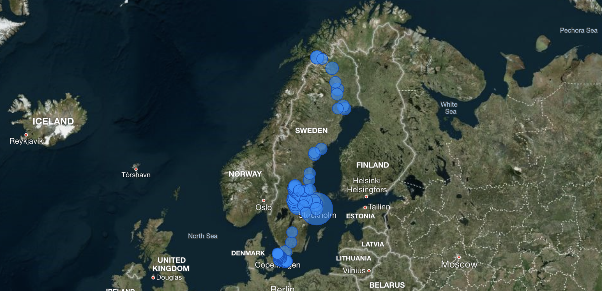
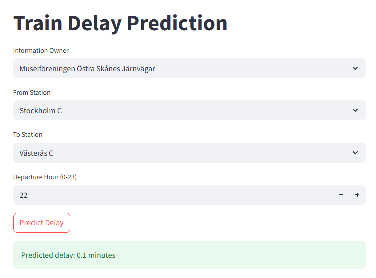
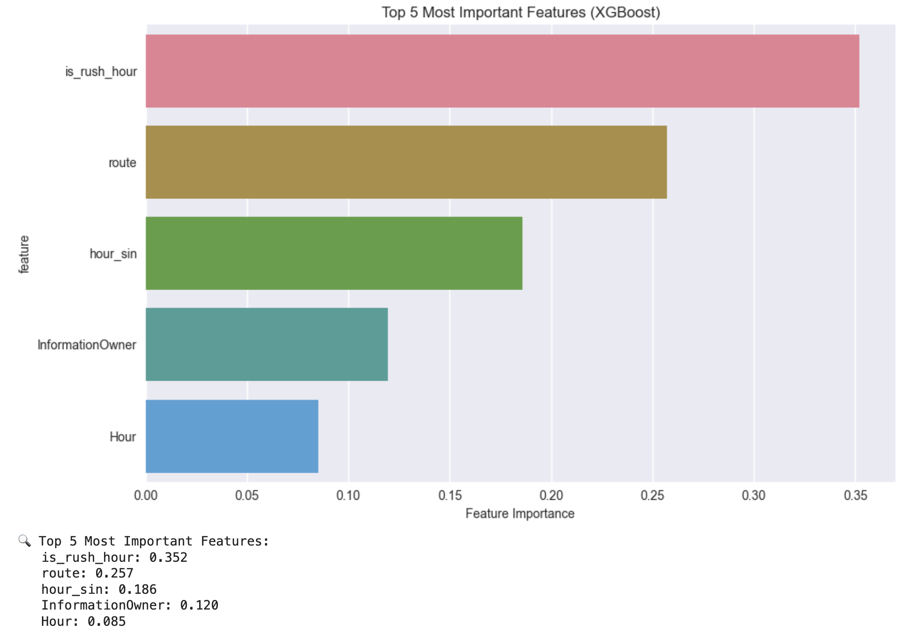

<p align="center"></p>
<h1 align="center">⚡ STORM</h1>
<p align="center"><b>Smart Train Observation & Reporting Model</b></p>

---

## 🚀 Introduction

This repository showcases a comprehensive project that demonstrates technical competencies across data engineering, cloud platforms, automation, data visualization, and applied machine learning. It highlights the development of an end-to-end data pipeline integrated with an AI model, emphasizing real-time data processing and predictive analytics.

---

## 🗺️ Project Overview

This project focuses on extracting, storing, and visualizing **Train Announcement** data from the Swedish Transport Administration's public API. It demonstrates working with live data feeds, automating data ingestion, and creating meaningful reports.

**Key objectives include:**

-  Extracting real-time train announcement data from Trafikverket's API  
-  Storing the data in a cloud database (Azure SQL)  
-  Automating the data collection and ingestion process  
-  Building a Power BI report to visualize train announcements effectively
-  Developing an AI model to forecast train delay, using historical data  
-  Deploying a Streamlit app to predict the train delay based on user entries

---

## 1️⃣ Data Extraction with Jupyter Notebook

The initial phase involves exploring and extracting train announcement data using a Jupyter Notebook (located in the `notebook` folder):

-  Connection established with Trafikverket's API ([https://data.trafikverket.se/](https://data.trafikverket.se/))  
-  Queried and retrieved train announcement data in JSON/XML format  
-  Parsed and transformed the data into structured tables  
-  Exported the processed data as CSV files into the `data` folder for validation and further use
-  Visualizing data using python libraries  

This step helps in understanding the API structure and the details of train schedules, delays, and statuses.

---

## 2️⃣ Cloud Storage with Azure SQL Database

To ensure scalable and efficient storage, an **Azure SQL Database** is provisioned:

-  A relational database schema is designed for train announcement data  
-  Tables optimized for querying time-series and event data are created  
-  Secure connections for data insertion and retrieval are established  
-  Indexing is configured to improve query performance  

This serves as the central repository for train announcement records.

---

## 3️⃣ Automated Data Pipeline Using Azure Functions and Power Automate

To maintain continuously updated data, the ingestion process is fully automated:

-  An **Azure Function** periodically calls the Trafikverket API to fetch new data  
-  The function processes and writes the data directly into the Azure SQL Database  
-  **Microsoft Power Automate** is used to schedule and orchestrate the execution of the Azure Function on a recurring basis  

This setup ensures the database reflects the most recent train announcements without manual effort.

---

## 4️⃣ Data Visualization with Power BI

<p align="center"></p>

A Power BI report is created to provide insights into the train announcement data:

-  Connected directly to the Azure SQL Database  
-  Dashboards highlight train schedules, delays, and announcements  
-  Filters and visual elements enable dynamic exploration  
-  The report is shared to facilitate easy access and stakeholder engagement  

This visualization supports effective monitoring and analysis of train operations based on live data.  
([🔗 View the interactive report](https://app.powerbi.com/reportEmbed?reportId=48a3bf00-09a3-4843-83c2-d6381d5168a4&autoAuth=true&ctid=a1795b64-dabd-4758-b988-b309292316cf))

---

## 5️⃣ AI-Powered Train Delay Forecasting  

To forecast train delays based on historical data, a machine learning model has been developed and integrated into a user-facing application:

-  Historical train departure data is read from CSV files and preprocessed for training  
-  An XGBoost model is trained to predict train delays based on features like scheduled departure time and actual departure  
-  The model's performance is evaluated using metrics such as Mean Absolute Error (MAE) on a test set  
-  A Streamlit app is built to allow users to input relevant trip details and receive delay predictions interactively. ([Check the app here](https://maxsalimi.streamlit.app/))  

<p align="center"></p>  
This component provides actionable insights to improve scheduling and operational efficiency.

---  

## 🗂️ Project Structure

```text
ProjectRoot/
├── README.md
├── notebooks/
│   ├── 01_fetch_and_clean.ipynb
│   ├── 02_analyze_departures.ipynb
│   ├── 03_train_model.ipynb
│   └── 04_train_model_using_csv.ipynb
├── data/
│   └── raw/
│       ├── train_departures.csv
│       └── stations.csv
├── streamlit/
│   ├── streamlit_app.py           # Streamlit web app
│   ├── model_info.json            # Model metadata
│   ├── to_station_options.json    # Dropdown options
│   ├── from_station_options.json  # Dropdown options
│   ├── info_owner_options.json    # Dropdown options
│   ├── encoders.pkl               # Label encoders
│   ├── trained_model.pkl          # Trained ML model
│   └── requirements.txt           # Streamlit dependencies
├── material/
│   ├── thunder_.png               # Logo/icon
│   └── storm.jpg                  # Project image
```

---

## 🛠️ Technologies Used

- **Python** & **Jupyter Notebook** for data extraction and transformation  
- **Azure SQL Database** for cloud-based storage  
- **Azure Functions** (PowerShell) for serverless automation  
- **Microsoft Power Automate** for task scheduling and orchestration  
- **Power BI** for interactive data visualization and reporting
- **XGBoost** for training a predictive model based on historical data
- **Streamlit** to quickly build a data app that receives user input and predicts train delays in minutes
- **Cursor** used as the IDE for development  

---

## 🏁 Conclusion

This project demonstrates the ability to design and automate a complete data engineering workflow — encompassing live data acquisition, cloud storage, serverless automation, and insightful reporting. It reflects proficiency in tools and platforms commonly used in enterprise data solutions.

Explore the code and resources provided. For further information or collaboration opportunities, feel free to connect.

---

<p align="center"><b>Thank you for visiting this portfolio!</b></p>

---

<p align="right"><i>Max</i><br>PhD Student & Data Engineer</p>

   
